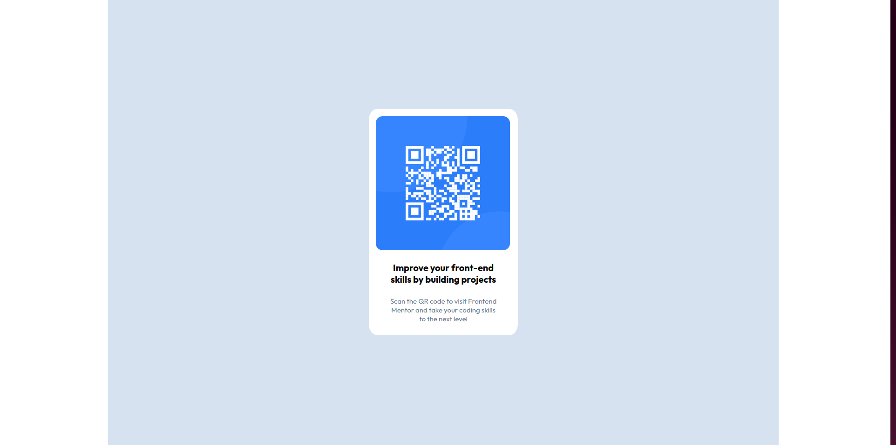

# Frontend Mentor - QR code component solution

This is a solution to the [QR code component challenge on Frontend Mentor](https://www.frontendmentor.io/challenges/qr-code-component-iux_sIO_H).

## Table of contents

- [Overview](#overview)
  - [Screenshot](#screenshot)
  - [Links](#links)
- [My process](#my-process)
  - [Built with](#built-with)
  - [What I learned](#what-i-learned)
  - [Continued development](#continued-development)
  - [Useful resources](#useful-resources)
- [Author](#author)

## Overview

This challenge requires to build a simple design file with QR code for desktop and mobile versions.

### Screenshot

### Links

- Solution URL: https://github.com/Shako-IT/qr-code-component-main.git
- Live Site URL: https://shako-it.github.io/qr-code-component-main

## My process

### Built with

- Semantic HTML5 markup
- CSS custom properties
- Flexbox
- Desktop-first workflow

### What I learned

This was a good start for me in practicing frontend; It is a simple challenge, but it helped me learn CSS and html in practice and think about solutions.

### Continued development

I look to be able to write better CSS, I need beeter understand of flexbod and CSS grid.

### Useful resources

- [Mozila Developers Network](https://developer.mozilla.org/en-US/) - This helped me to find some examples of code.

## Author

- Website - [Shalva Mghebrishvili](https://github.com/Shako-IT)
- Frontend Mentor - [@Shako-IT](https://www.frontendmentor.io/profile/Shako-IT)
